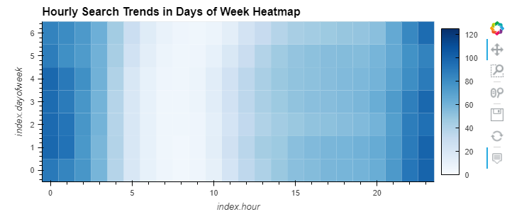
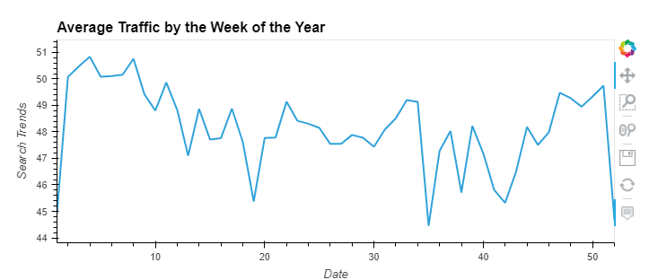
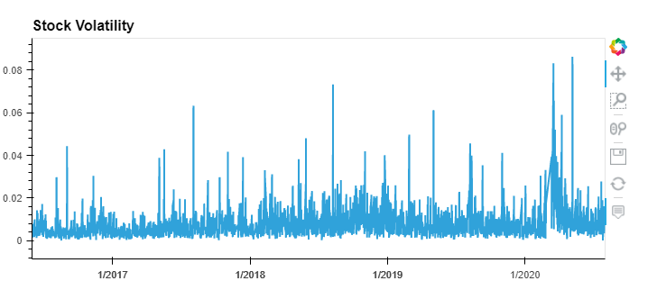
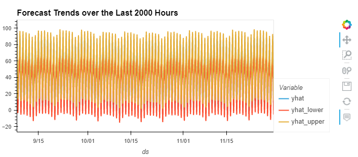
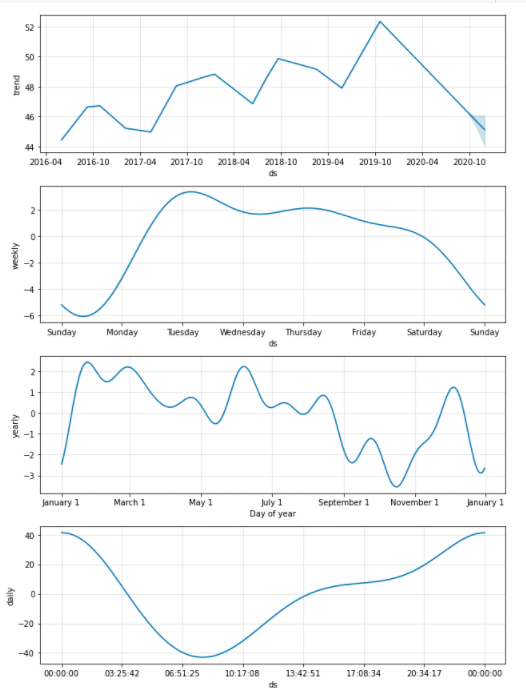
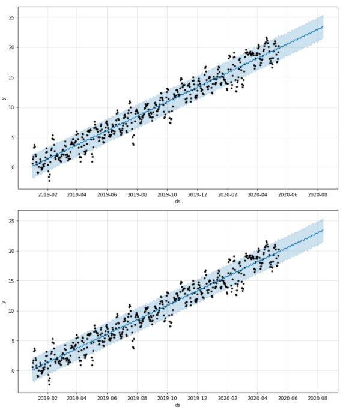

# Challenge11


# Forecasting Net Prophet

This is a Jupyter notebook that analyzes MercadoLibre's financial and user data in clever ways to make the company grow. It aims to find out if the ability to predict search traffic can translate into the ability to successfully trade the stock. 

---

## Technologies

This project leverages Python 3.7 with the following packages and dependencies:

* [pandas](https://pandas.pydata.org/) - An open-source data analysis and manipulation tool

* [hvplot.pandas](https://hvplot.holoviz.org/user_guide/Introduction.html) - Creates modern and interactive plots and makes it easier to explore the properties of the data

* [holoviews](https://holoviews.org/) - An open-source Python library designed to make data analysis and visualization seamless and simple

* [fbprophet](https://facebook.github.io/prophet/) - A forecasting procedure that provides completely automated forecasts

* [%matplotlib inline](https://stackoverflow.com/questions/43027980/purpose-of-matplotlib-inline) - Inline plotting in notebook

* [datetime](https://docs.python.org/3/library/datetime.html) -  Supplies classes for manipulating dates and times

---

## Installation Guide

Python 3.7, GitBash, fbprophet, and JupyterLab are required to be installed before running the application.

---

## Usage

To run the application simply clone the repository and run the **forecasting_net_prophet.ipynb** with:

```Google Colab
forecasting_net_prophet.ipynb
```

Attached screenshots below show the different plots:

  











---

## Contributors

Brought to you by Christine Guo (www.linkedin.com/in/christine-guo)

---

## License

NoNe